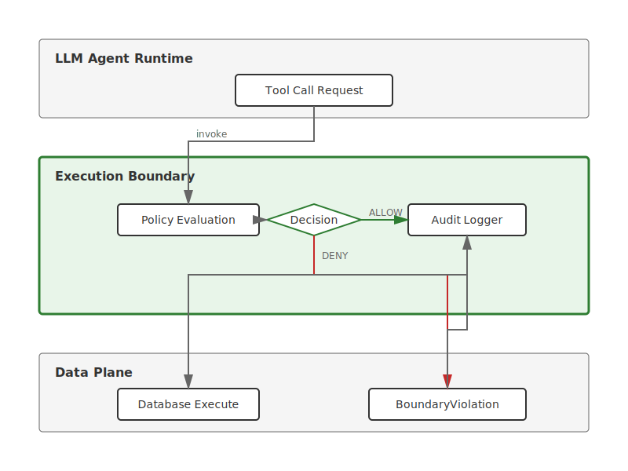

# AI Execution Boundaries

**Validation layer for AI agents with write access.**

---

## The Problem

AI agents get write access with only prompts as constraints.

```
Prompt: "Only update records where status='pending'"

Agent interprets "pending_review" as close enough.
Updates wrong records.
No error. No audit trail. Silent failure.
```

This happens in production. Repeatedly.

---

## The Solution



**Execution boundaries validate before execution.**

**Flow:**
1. Agent invokes tool call
2. Execution boundary evaluates policy
3. Decision: ALLOW or DENY
4. Audit logger records attempt
5. Database executes (if allowed) or raises BoundaryViolation (if denied)

```python
from execution_boundary import boundary, Policy

@boundary(policy=Policy.exact_match("status", "pending"))
def update_record(data):
    return db.update(data)
```

**ALLOWED** ✓ `{"status": "pending"}`  
**BLOCKED** ✗ `{"status": "approved"}`  
**AUDITED** → Every attempt logged


---

## Installation

```bash
# From source
git clone https://github.com/Jh-justinHarmon/ai-execution-boundaries
cd ai-execution-boundaries
pip install -e .

# With development dependencies
pip install -e ".[dev]"
```

Or clone and install locally:

```bash
git clone https://github.com/Jh-justinHarmon/ai-execution-boundaries.git
cd ai-execution-boundaries
pip install -e .
```

---

## Quick Start

**1. Define a policy:**

```python
from execution_boundary import Policy

policy = Policy.exact_match("status", "pending")
```

**2. Apply boundary to function:**

```python
from execution_boundary import boundary

@boundary(policy=policy, audit=True)
def update_record(data):
    return {"success": True, "data": data}
```

**3. Execute:**

```python
# This works
update_record({"status": "pending", "id": 1})

# This raises BoundaryViolation
update_record({"status": "approved", "id": 2})
```

---

## Examples

**See `examples/` directory:**

- `allowed.py` - Valid execution
- `blocked.py` - Blocked execution
- `audit.py` - Audit trail output

**Run:**

```bash
python examples/allowed.py
python examples/blocked.py
python examples/audit.py
```

---

## Why This Matters

**Prompts guide behavior. Execution boundaries enforce behavior.**

AI agents need:
- **Validation** before execution (not after)
- **Audit trails** for every attempt
- **Deterministic blocking** when policies fail

This library provides the missing enforcement layer.

---

## What This Is

A minimal validation primitive for AI agent execution.

**NOT:**
- An agent framework
- An orchestration system
- A prompt optimizer

**JUST:**
- A decorator that validates before executing
- A policy system for defining constraints
- An audit logger for tracking attempts

---

## Why Not OPA / Existing Policy Engines?

**OPA, Envoy filters, and Kubernetes admission controllers are excellent for infrastructure policy enforcement.**

This library addresses a different layer: **agent tool call semantics**.

**Key differences:**

| Concern | OPA/Envoy | Execution Boundaries |
|---------|-----------|---------------------|
| **Policy target** | HTTP requests, K8s resources | Agent tool calls, function invocations |
| **Integration point** | Network layer, API gateway | Python decorator, function wrapper |
| **Policy language** | Rego, external DSL | Python policy objects |
| **Deployment** | Sidecar, admission webhook | Inline, same process |
| **Async support** | Yes | Not yet (roadmap) |
| **Agent-aware** | No | Yes (designed for LLM tool calls) |

**Use OPA when:** You need infrastructure-wide policy enforcement across services, languages, and protocols.

**Use execution boundaries when:** You need lightweight, inline validation for Python agent tool calls without external policy servers.

**Future:** Integration with OPA as a policy backend is planned.

---

## License

Apache 2.0

---

## Further Reading

- [Prompts Are Not Governance](docs/prompts-are-not-governance.md)
- Why AI systems need execution boundaries
- How validation prevents silent failures
